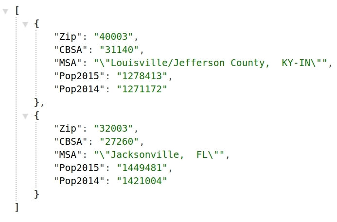

## NodeJS Server for Population Data

- Node JS API is hosted at Google Cloud and can be accessed via this link:

    [Popluation API Server](https://neon-semiotics-204505.appspot.com/getPopData?zip=[%2240003%22,%2232003%22])
    
- End Points to test the API link:

    __[https://neon-semiotics-204505.appspot.com/getPopData?zip=["40003","32003"]](https://neon-semiotics-204505.appspot.com/getPopData?zip=[%2240003%22,%2232003%22])__
- Here is a snapshot of above input:

#### Created by [Amit Jha](mailto:amitjha@usc.edu)