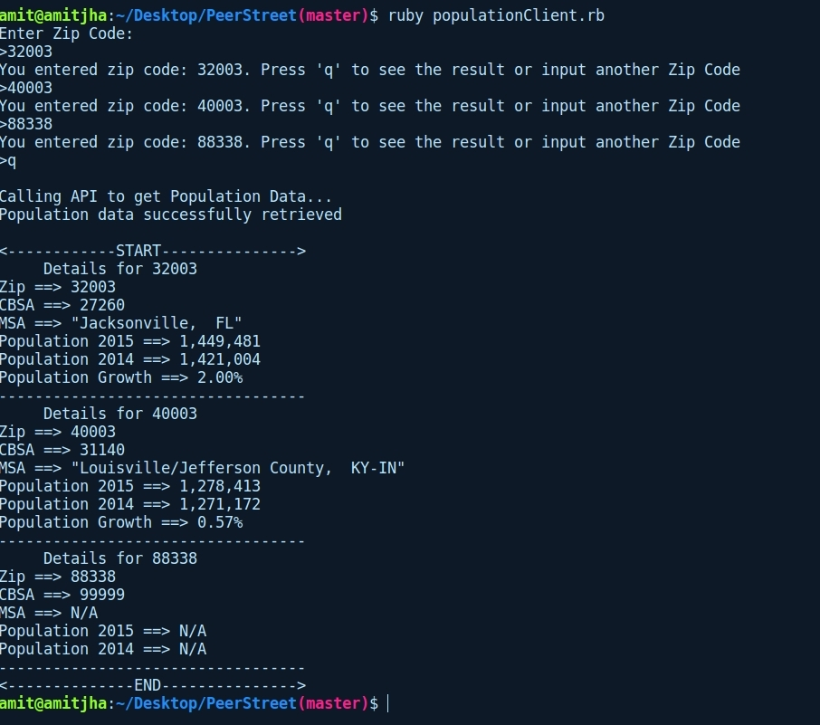

## Ruby Client for Population Data

### Steps to exectute ruby client

- Make sure to have Ruby installed on your system
- Clone the repository with client folder inside
- Move to `populationClient` folder
- Open Terminal and Run following command and follow the instruction
    
    ```
        ruby populationClient.rb
    ```
- Follow the prompt to enter Zip codes one after another. After all zip codes are provided to the prompt press __q__ to exectute the program.
- Here is a snapshot of one example:




#### Created by [Amit Jha](mailto:amitjha@usc.edu)